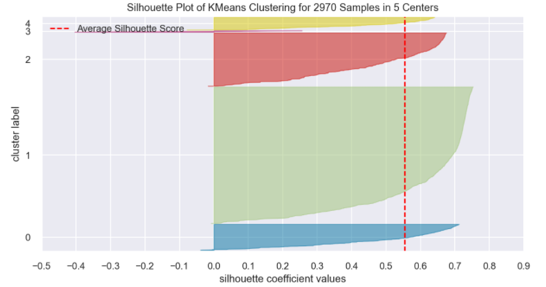
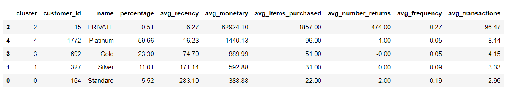

# High-Value Customer Identification.

## 1.0. Description: 

This project aims to realize a selection of high value customers for a British E-Commerce company using Clustering techniques.

## 2.0. Business Problem:

It is known that exists several types of customers in an E-Commerce Company, with different types of behavior. It is also known that different types of behavior requires different types of approach by the business team. So, the context of the problem it's a british E-Commerce company whose Marketing Team wants to build a Loyalty Program after realizing that some customers of their purchase base buy more expensive products, with hight frequency, and end up contributing with a significant share to the companie's revenue.

The challenge is to realize a selection of eligible customers for the program, utilizing advanced Data Science techniques.

## 3.0. Solution Strategy:

### 3.1. Data Collection:

Download of the CSV file from the Kaggle Competition.

### 3.2. Data Description:

Here I focused on seeing the quantitity and quality of the data. Aimed to answer questions like how much data is available and the conditition of them. Checked the columns name, data dimensions, data types, NA's and done a descriptive statistics with all features, including numerical and categorical.

### 3.3. Data Filtering:

Filtered data considering descriptive statistics and business assumptions.

### 3.4. Feature Engineering: 

Derivated new features that make business sense from the existing ones and could pontentially help on the Clustering Models.

### 3.5. Exploratory Data Analysis: 

Sought to understand a litte bit more of the data with Pandas Profiling, pairplot and Space Study.

- **3.5.1. Pandas Profiling:** Visualizing and understanding the distribution of each variable.

- **3.5.2. Pairplot:** Seeing correlated features two by two.

- **3.5.3. Space Study:** Translating a high-dimensional vector into a two dimension space and ploting this to try to see better clusters.

### 3.6. Data Preparation: 

Also called pre processing, consists in "translate" raw data into a language that the model understands. Here I rescaled all features using MinMaxScaler due their non normal distributions and outliers.

### 3.7. Feature Selection: 

Used business knowledge for chose the best features.

### 3.8. Hyperparameter Fine Tunning: 

I tested six K values in three different models using the Silhouette Score as a metric.

### 3.9. Final Model:

Reruned K-Means with 5 clusters ( K ) due the great results.

### 3.10. Cluster Analysis:

Analyzed the performance of the model with Silhouette Plot, Pairplot and UMAP.

### 3.11. Cluster Insights:

Visualized characteristics of each cluster and answered business questions.

## 4.0. Top 3 Data Insights:

- **H1**: The Private cluster customers represent 20% of purchase volume per item.

**FALSE**. They represent only 10% of purchase volume per item.

- **H2**: The Private cluster customers represent 10% of total revenue.

**TRUE**. They represent 20% of the total revenue.

- **H3**: The Private Cluster customers max recency it's less than the total database mean.

**TRUE**. The Private Cluster max recency it's 38% smaller than the total database mean.

## 5.0. Machine Learning Models Applied:

- K-Means
- Gaussian Mixture Model ( GMM )
- Hierarchical Clustering

## 6.0. Machine Learning Model Performance:

K-Means with K equal to 5 due the good Silhouette Score.

## 7.0. Business Report:

**Clusters Profile:**

### 7.1. How many customers the group will have?

**15.**

### 7.2. What's the main characteristics of those customers?

- Percentage in relation with database: **0.51%**
- Average Recency: **6.27 days until last purchase**
- Average Revenue: **$62.924,10**
- Median number of items purchased: **1857 items**
- Median number of returns: **474 items**
- Average frequency: **0.27 purchases per day**
- Average number of transactions: **96.47**

### 7.3. What's the percentage of contribution in revenue from the Private customers?

**20%**.

### 7.4. What's the conditions for a customer be elegible for the Privates?

The conditions are be in this streak for two consecutive months:
    
- Revenue: **59.120,23 - 149.018,85 dollars**
- Number of items purchased: **1210 - 3810**
- Frequency: **0.17 - 0.36**

### 7.5. What's the conditions for a customer be removed from the Privates?

**Be outside the eligible streak or break the streak for three consecutive months**

### 7.6. What actions the Marketing Team can realize to increase the revenue? 

They can give cumulative benefits for the three best groups. So the most important group ( Private ) will have access to all benefits of the two below plus more exclusive ones.

This would estimulate the Private group to continue on the company and the hierarchically smaller ones to consume more and more frequently in order to progress and gain more and more exclusive benefits.

**Benefits:**

**Private Group:**

- Runs for a trip in the end of the year.
- Prioritary access to new products and personalized offers and recomendations.
- Unlimited access to free shipping and fast delivery of millions of items.
- Sistema de Pontuação: os clientes podem ganhar pontos simplesmente fazendo o cadastro, assim como fazendo aniversário, indicando amigos, deixando uma avaliação ou seguindo a empresa nas redes sociais.

**Platinum Group:**

- Unlimited access to free shipping and fast delivery of millions of items.
- Scoring System: Customers can earn points by signing up, as well as on their birthday date, referring friends, writing a review or following the company on social media.

**Gold Group:**

- Scoring System: Customers can earn points by signing up, as well as on their birthday date, referring friends, writing a review or following the company on social media.

## 8.0. Conclusion:

The project details the step by step of building a Loyalty Program considering realistic scenarios of the corporate world, from the data extraction to the elaboration of the Marketing Campaign. In addition to Clustering techniques, it allowed me to learn a lot about customer retention strategies. I am now confident that by implementing something similar within a real company I will be able to significantly contribute to its profit.

A sentence that marked me during the elaboration was: **"Marketing isn't an expense, it's an investment!""**

Therefore, I'm finishing this stage of learning with a completly different vision about Marketing, a much more optimistic view. Now I have a great admiration about this area!

## 9.0. Next Steps to improve:

- Run the models on embedding space for better score.
- Make a script to rerun the model from time to time and actualize the clusters. Also deploy it on a production environment.
- Predict the revenue of the 'Private' cluster for the next months.

## 10.0. References:

- [Comunidade DS](https://www.comunidadedatascience.com/como-criar-um-programa-de-fidelidade-para-empresa/)
